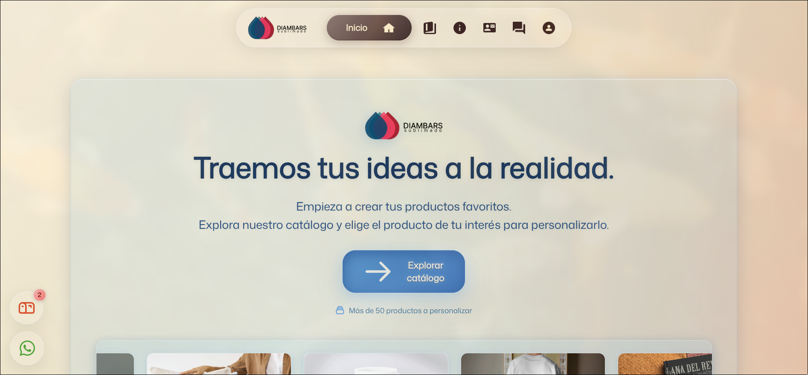

  

## Tecnologías

 

## Portafolio

### 🌐 Diambars Sublim
> Plataforma de e-Commerce para la compra de productos personalizables a base de sublimación.  Frontend completamente desarrollado por mí.

  
  
  

    <a href="https://diambars-sublim.vercel.app">Página oficial</a>
  

**Construido con:** React • Node.js • MongoDB • CSS

---

  
  

###